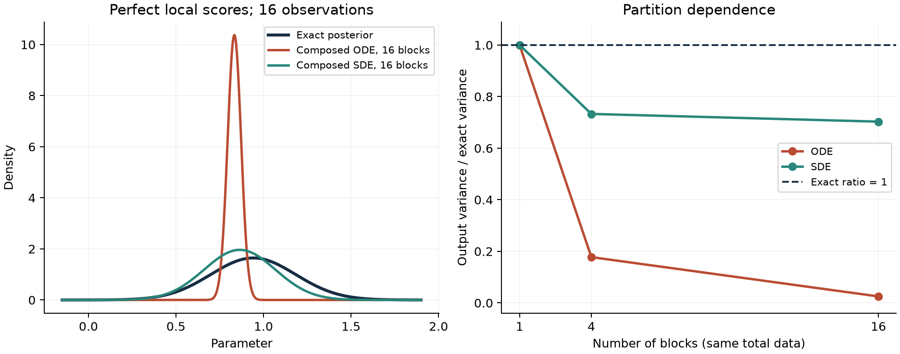

# 组合后验的解析审计与当前研究问题

日期：2026-09-09。证据类型：数学推导、解析 score 数值积分、官方代码公式核验。本轮没有训练神经网络或提交 SCNet 作业。

当前研究问题：在大量条件独立观测或独立组的摊销贝叶斯推断中，能否以小批量计算实现方差可控的后验校正，并保持后验精度？现有方法已分别提供组合、数值稳定化和路径校正；本项目需要论证它们在大组数下的计算与误差能否同时受控。

## 1. 检查对象与范围

检查 [Arruda et al., ICLR 2026, v5](https://arxiv.org/html/2505.14429v5) 的式 (6)–(9)。官方仓库固定于 `f01a3add0b02e420fcf8b61e629f6b202954b4b6`，本地路径 `../external/hierarchical-abi`。

对应源码：`diffusion_model/sampling_algorithms.py` 的 315–326 行组合 score、158–164 行初始方差、395–419 行 SDE/ODE 单步；`diffusion_model/diffusion_sde.py` 的 cosine VP 调度。这里直接调用官方调度和单步函数，检查我们推导出的系数；没有重跑作者神经网络实验，也没有复现作者全部超参数搜索。

全文中的组合形式为

\[
\tilde s_t(x)=d(t)\left[(1-G)(1-t)\nabla\log p(x)+\sum_{g=1}^G s_{g,t}(x)\right].
\]

先验项是原先验在当前坐标处的 score。本文采用标准正态先验，恰好也是 VP 的不变分布。选择论文定义允许的指数调度 \(d(t)=G^{-t}\)，因而 \(d(0)=1\)、\(d(1)=1/G\)，初始分布为标准正态。它是一组明确的审计参数，不代表作者选择的最优参数。

## 2. 完全无信息的观测仍可能导致方差缩小

令 \(\theta\sim N(0,1)\)，各组观测的似然均与 \(\theta\) 无关。对任意组数，正确后验以及每个组后验都等于 \(N(0,1)\)。因此所有真实局部 score 均为 \(-x\)，组合公式化为

\[
\tilde s_t(x)=-C_G(t)x,\qquad C_G(t)=G^{-t}[1+(G-1)t].
\]

对 \(G>1\)、\(0<t<1\)，加权算术—几何平均不等式给出

\[
1+(G-1)t=(1-t)+tG>G^t,\quad C_G(t)>1.
\]

VP 过程的 \(f(x,t)=-\beta(t)x/2\)、\(g(t)^2=\beta(t)\)。将上述 score 代入 probability-flow ODE，按 \(t:1\to0\) 积分，有

\[
\frac{dx}{dt}=\frac{\beta(t)}2[C_G(t)-1]x,
\qquad
V(0)=\exp\left[-\int_0^1\beta(t)[C_G(t)-1]\,dt\right]<1.
\]

该式是连续时间结果，局部 score 没有近似误差。对于未截断 cosine VP，\(\beta(t)=\pi\tan(\pi t/2)\)。由于 \(C_G(t)-1=O(1-t)\)，积分在高噪声端有限。数值积分得到：

| 独立组数 | 正确方差 | ODE 输出方差 |
|---:|---:|---:|
| 1 | 1 | 1 |
| 4 | 1 | 0.4892098778 |
| 16 | 1 | 0.0598592412 |

这证明仅有 \(d(0)=1\) 的终点代数条件不足以保证该 ODE 的终点分布正确。它没有证明所有调度均失败；例如本无信息特例使用 \(d(t)=[1+(G-1)t]^{-1}\) 就恢复了 \(C_G(t)=1\)。这个特例的修正也不能直接推广为一般后验算法。

## 3. 同一批有信息数据的分块依赖

取 \(\theta\sim N(0,1)\)、\(y_i\mid\theta\sim N(\theta,1)\)，共 16 条观测，\(\bar y=1\)。由于高斯充分统计量的性质，结果适用于任何均值为 1 的这类数据，不要求每条记录相同。

正确后验为 \(N(16/17,1/17)\)。每块包含 \(b\) 条观测，块数 \(G=16/b\)。使用解析块后验 score、cosine 调度、log-SNR 截断 \([-15,15]\)，得到：

| 分块与积分方法 | 后验均值 | 后验方差 | 方差 / 正确方差 |
|---|---:|---:|---:|
| 解析目标 | 0.941176 | 0.0588235 | 1 |
| 16 块，指数 damping，ODE | 0.833649 | 0.00147960 | 0.0251533 |
| 4 块，指数 damping，ODE | 0.966975 | 0.0104441 | 0.177550 |
| 1 块，ODE | 0.941050 | 0.0588238 | 1.000005 |
| 16 块，指数 damping，SDE | 0.864290 | 0.0413512 | 0.702970 |
| 4 块，指数 damping，SDE | 0.955767 | 0.0431084 | 0.732842 |
| 1 块，SDE | 0.941176 | 0.0588238 | 1.000005 |

这里 SDE 的数值结果来自精确的高斯矩演化方程，不含有限 Monte Carlo 样本误差。设组合 score 为 \(-C(t)x+B(t)\)，按反向时间积分时：

\[
\begin{aligned}
\text{ODE: }&\quad \mu'=\tfrac12\beta[(C-1)\mu-B],\quad (\log V)'=\beta(C-1),\\
\text{SDE: }&\quad \mu'=\beta[(C-\tfrac12)\mu-B],\quad V'=\beta[(2C-1)V-1].
\end{aligned}
\]

对 16 块指数 damping 的条件，用 DOP853 和 Radau 两种方法、相对容差 \(10^{-11}\) 重复计算，均值差低于 \(4\times10^{-12}\)，方差差低于 \(3\times10^{-14}\)。将 log-SNR 截断扩大到 \([-25,25]\) 后，ODE 方差比为 0.0249386，SDE 为 0.703428，偏差仍然存在。

单块 ODE 的小均值偏差来自以纯噪声代替有限截断下的精确初始 marginal；使用精确初始 marginal 和完整后验 score 的控制条件恢复相应截断终点。不能把这一小误差与组合造成的偏差混合。



## 4. 已有工作覆盖的内容

[Linhart et al., TMLR 2026, v3](https://arxiv.org/html/2404.07593v3) 第 2.3 节已经说明人工 bridge 不等于真实扩散。第 3.1 节式 (12) 给出缺失的 correction；第 3.2–3.3 节推导 JAC/GAUSS。在先验与各局部后验均为高斯、协方差精确时，它们的目标 score 修正精确。本文独立检查了 297 个时间与分块条件，GAUSS 代数公式与完整后验 score 的最大系数差为 \(1.60\times10^{-14}\)。这个控制使用真实高斯协方差，未复现由有限 DDIM 样本估计协方差的误差。

因此高斯修正已有明确先例。本审计可作为特定方法的可靠性证据，不能单独被表述为新的通用算法。

一般的 Feynman–Kac 粒子修正也已有工作。2026 年的 [Soiffer et al.](https://arxiv.org/html/2606.23920) 第 4.1 节与附录 C 区分组合采样偏差和 score 估计误差；[ACE](https://arxiv.org/html/2512.10339) 第 2.4 节还覆盖时变指数及相应权重项。单独提出加权粒子或时变 damping 同样没有充分新颖性。

## 5. 当前聚焦的候选：方差可控的小批量后验校正

实际需求是：一个局部模型训练完成后，科学仪器持续产生新的独立观测，推断程序能处理大量观测，并给出可信的参数不确定性。每个采样步骤遍历全部观测和大协方差矩阵会影响可用性；仅仅保证采样过程运行稳定又不充分。

核心问题可写成：**在每步只评估部分组的条件下，能否给出组合后验误差与计算成本的可验证关系，并达到优于全量校正的精度—成本曲线？** 当前结果支持研究这个问题的必要性，尚未证明存在有优势的新算法。

已经明确的一处数学障碍是校正项的非线性。固定粒子状态与时间，令 \(S=c+\sum_{g=1}^G s_g\)，\(\hat S=c+G M^{-1}\sum_{j=1}^M s_{I_j}\)，其中 \(I_j\) 独立均匀有放回抽样。尽管 \(E\hat S=S\)，有

\[
E\|\hat S\|^2=\|S\|^2+\frac{G^2}{M}\operatorname{tr}\operatorname{Cov}_{I}(s_I).
\]

Feynman–Kac 的组合校正包含这类平方项，因此把无偏的小批量 score 直接代入校正公式，通常会产生额外偏差。组间 score 方差可能随粒子状态改变，归一化权重无法一般消除它。对无放回抽样应另用有限总体修正，不能照搬这里的系数。

对两份条件独立的批量估计，\(E[\hat S_A^\top\hat S_B]=\|S\|^2\)。本次在异方差高斯组的三个状态上，穷举全部 16 个批量及 256 个批量对，核验了两个恒等式。交叉乘积是经典无偏估计技巧，只构成方法推导的一个部件。

更进一步，若两份估计的协方差都是 \(\Sigma\)，则

\[
\operatorname{Var}(\hat S_A^\top\hat S_B)=2S^\top\Sigma S+\operatorname{tr}(\Sigma^2).
\]

无偏不意味着方差受控。即使瞬时校正估计无偏，有限步的指数权重与重采样仍需要独立误差分析；\(E\exp(h\hat g)\) 一般不等于 \(\exp(hg)\)。不能由以上恒等式宣布整个后验采样无偏。

候选方法的具体论证路线是：利用可解析的高斯部分或固定锚点作为控制变量，只对非高斯残差进行随机校正；推导包含批量数、步长、粒子数和残差方差的误差界。需要核查已有随机权重 SMC 与控制变量方法是否已经完整覆盖此构造，再判断独立贡献。

在进入神经训练前，必须证明或否定：控制变量是否降低了随组数增长的关键方差项；缩小步长或增加粒子以补偿随机误差后，计算优势是否仍然存在。若优势被抵消，就终止这一候选。

验证需包含全量 GAUSS/JAC、全量 Feynman–Kac 校正、普通小批量代入和候选校正。高斯条件先验证解析精度；非高斯条件使用可独立收敛核查的积分或采样参照，测试不同分块、加入无信息组及不同信息量。训练模型误差、组合误差、随机批量误差和时间离散误差分别记录。尚未实施这些神经模型与非高斯对照。

## 6. 可复核记录

运行命令（仓库根目录）：

```bash
../venv/bin/python oracle_composition_audit.py --official-repo ../external/hierarchical-abi --output results/oracle_composition_20260909
```

环境依赖：Python、NumPy、SciPy、PyTorch、Matplotlib、tqdm、prettytable。实际版本、脚本 SHA-256、官方代码 commit、24 个主条件、8 个独立积分/截断条件、297 个 GAUSS 恒等式条件、无信息反例与批量穷举结果均保存在 `results/oracle_composition_20260909/verification.json`。图像同时提供 PNG 与 PDF。

当前状态：反例与数值审计通过；小批量平方项恒等式通过；新算法的新颖性、方差界、完整采样收敛和非高斯优势尚未确立。
